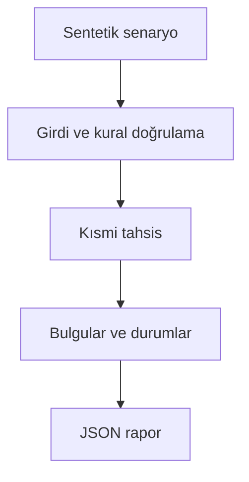

# Mimari

Belirsiz ödemeyi rastgele faturaya kapatmadan, ücret ve iade sonrası net tutarı izlemek.

Asıl alan akışı: **Payment netting → eligible invoices → explicit allocation → currency controls**. CLI JSON yükler, çekirdek `run(config)` alan motorunu çağırır ve JSON seri hale getirir. Veritabanı kullanan örnekler geçici dizinde izole edilir; kalıcı sınıflar doğrudan çağrılırken dosya yolu dışarıdan verilir.

## İnvariant ve başarısızlık sınırı

Tutarlar tamsayı minor unit; açık referans yoksa yalnız bir uygun aday otomatik eşleşir.

Kur dönüşümü ve banka entegrasyonu yoktur; toleransla kapanan bakiyeler raporda görünmeye devam eder.

Her hata kararı makine tarafından okunabilir çıktı veya açık exception üretir. Geçersiz yapılandırma sessizce düzeltilmez. Olası tekrarların güvenliği ilgili çekirdeğin kabul kurallarına bağlıdır; bütün projelere ortak bir retry uygulanmaz.
